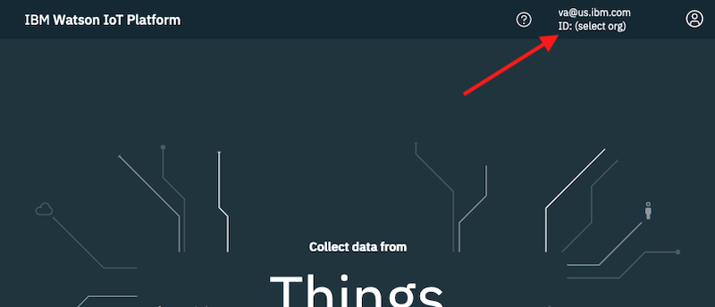

# Integrate Watson IoT with HERE Tracking for real-time IoT device management and tracking

With the [Watson IoT Platform](https://internetofthings.ibmcloud.com/) and [HERE Tracking](https://developer.here.com/products/tracking) you can plan and monitor the safe and timely delivery of goods and supplies (e.g., food, medicine, livestock, etc.) in real-time.

Learn how to develop an IoT application with the Watson IoT Platform and [Node-RED](https://nodered.org/) that will gather data received from IoT sensors (e.g. vehicle GPS, edge devices, etc.). The geolocation data can then be integrated with HERE Tracking for route planning, geofencing, and visualization.

IBM Watson IoT service provides a platform that lets you manage, communicate with, and consume data from connected devices and gateways.

Node-RED is an open source visual programming tool that offers a browser-based flow editor for wiring together devices, APIs, and online services. 

HERE Tracking is a location platform that makes it quick and easy to track your devices indoor and outdoor, see traces on a map, create geofences and get custom notifications.


# Learning Objective

In this tutorial, you will learn how to:

- Create an IoT application on IBM Cloud using Node-RED and Watson IoT
- Add and manage IoT devices with the Watson IoT Platform
- Integrate location awareness using cloud-to-cloud connection with HERE Tracking
- Add and manage virtual devices with HERE Tracking
- Send data from Watson IoT to HERE Tracking using Node-RED

To keep the focus primarily on the platforms and tools and not hardware or specific IoT devices, sample data will be coming from a simulator instead of an actual device.


# Prerequisites

- Clone the [GitHub repository](https://github.com/ibm/wiotp-here-tutorial) for this tutorial
- Register for an [IBM Cloud](https://www.ibm.com/account/reg/us-en/signup) account
- Register for a [HERE](https://developer.here.com/sign-up) account
- (for simulating data) Laptop/workstation with [Node.js installed](https://developer.ibm.com/tutorials/learn-nodejs-installing-node-nvm-and-vscode/)


# Steps

1. [Create an Internet of Things Platform Starter application](#)
1. [Add an IoT Device Type and Device to Watson IoT](#)
1. [Simulate IoT data](#)
1. [Set up HERE Tracking](#)
1. [Add a Virtual Device to HERE Tracking](#)
1. [Create Node-RED flow to pass message from Watson IoT to HERE Tracking](#)
1. [Test the integration](#)

## Create an Internet of Things Platform Starter application

The first step is to create an IoT application on IBM Cloud using the IBM Watson IoT Platform service and the Node-RED App Starter Kit.

Follow the instructions in [this tutorial](https://developer.ibm.com/tutorials/how-to-create-an-internet-of-things-platform-starter-application/) to provision a Node-RED App and Watson IoT Platform service.

## Add an IoT Device Type and Device 

After completing the previous step, you will have a Node-RED Starter Kit application connected to the IBM Watson IoT Platform. You can now proceed to adding an device to Watson IoT.

From your browser, access the [IBM Watson IoT Platform service created in the first step](https://internetofthings.ibmcloud.com/). Be sure to select your org:



#### Add a Device Type in the IBM Watson IoT Platform service

1. From the sidebar, select **Devices**
1. In the _Devices_ page, select the **Device Types** tab
1. Click **Add Device Type** to open the _Add Type_ form
1. Select **Device** for the _Type_
1. Enter a unique _Name_ for the device type (e.g., `wiotp-device-type-01`)
1. Click **Next**
1. Click **Finish**

#### Add a Device in the IBM Watson IoT Platform service

1. From the sidebar, select **Devices**
1. In the _Devices_ page, select the **Browse** tab
1. Click **Add Device** to open the _Add Type_ form
1. For _Device Type_, select the device type created earlier (e.g., `wiotp-device-type-01`)
1. Enter a unique _Device ID_ for the device (e.g., `wiotp-device-01`)
1. Click **Next**
1. Click **Next** on the _Device Information_ screen
1. Enter an optional **Authentication Token** or leave blank to be assigned a generated token
1. Click **Next** on the _Security_ screen
1. Click **Finish**

    Make note of the `Organization ID` and also the `Authentication Token` for the device. 

    > **Note**: You will not be able to retrieve the `Authentication Token` later. This will be different from the service `Authentication Token` you will create in the below step.

#### Generate an API Key

1. From the sidebar, select **Apps**
1. In the _App_ page, select the **Browse** tab
1. Click **Generate API Key** to open the _Generate API Key_ form
1. (optional) Enter a _Description_ for the key
1. (optional) Enable and set a date for _API Key Expires_
1. Click **Next**
1. Select **Standard Application** for the _Role_
1. Click **Generate Key**

    Make note of the `API Key` and also the `Authentication Token` for the Watson IoT Platform service.

    > **Note**: You will not be able to retrieve the `Authentication Token` later. This will be different from the device `Authentication Token` you created in the above step.

1. Click **Close**

## Simulate IoT data

The tutorial provides some sample data and a basic simulator to send the data to the IoT platform. This can provide quick and easy testing of your set up.

#### View recent messages

1. From your browser

    1. Go back into the IBM Watson IoT Platform dashboard
    1. In the sidebar, select **Devices**
    1. In the _Devices_ page, select the **Browse** tab
    1. In the Devices list table, click the **&#8594;** for your device

        

    1. In the _Device Drilldown_ page, click on **Recent Events**

        Recent events/messages received by the device can be viewed in this section

#### Send messages using the simulator

To configure and run the simulator application

1. Go into the `simulator` directory of the cloned repo
1. Copy the `.env.example` file in the `simulator` directory, and create a new file named `.env`
1. Edit the newly created `.env` file and update the environment variables with values noted in the earlier steps:

    - `WIOTP_ORG_ID`: set to the Organization ID of your Watson IoT Platform service
    - `WIOTP_TYPE_ID`: set to the Name of your device type (e.g., `wiotp-device-type-01`)
    - `WIOTP_DEVICE_ID`: set to the Device ID of your device (e.g., `wiotp-device-01`)
    - `WIOTP_AUTH_TOKEN`: set to the Authentication Token of your device

1. From a terminal:

    1. Go into the `simulator` directory of the cloned repo  
    1. Install the dependencies: `npm install`
    1. Run the command: `node device-simulator.js sample-data/sample-data.json`

        The simulator will connects to your instance of Watson IoT Platform and the contents of the `sample-data/sample-data.json` file will be sent (mimicking possible data coming from a device). 
        
You should be able to see the messages show up in the device's _Recent Events_ table to confirm your set up.

## Set up HERE Tracking

1. Sign in to the [HERE Tracking Admin Portal](https://admin.tracking.here.com/)
1. If you do not already have one, create a project in the Admin Portal: https://developer.here.com/documentation/tracking/dev_guide/topics/projects.html

    1. Click the **Create new project** button
    1. Enter a **Project name** in the _Create new project_ form
    1. Click the _I agree to the Developer Service Terms_ checkbox
    1. Click the **Create** button

        

         After a few seconds your project will be ready.

1. Click on the **App IDs** tab
1. Click on the **View App ID** button for the _Cloud-to-Cloud Connector_

    Make note of the `APP ID`.

## Add a Virtual Device to HERE Tracking

HERE Tracking is hardware-agnostic and can be used by any device that produces conforming telemetry. For devices that cannot make direct connections to HERE Tracking or do not provide proper telemetry data, [cloud-to-cloud connectivity](https://developer.here.com/documentation/tracking/dev_guide/topics/cloud-to-cloud-connection.html) is available.

In this tutorial, we will a set up cloud-to-cloud connection from IBM Cloud to HERE Tracking so messages received by Watson IoT platform can be converted into the proper format and sent to HERE Tracking.

For cloud-to-cloud connectivity, a virtual device is defined and registered. The hardware device would send it data to an external service (in the case, the Watson IoT Platform service), the data is properly formatted and forwarded HERE Tracking (using the virtual device credentials).

#### Create a virtual device and obtain a license

From a terminal:

1. Login in to HERE Tracking and obtain an Access Token, with the command:

    ```
    curl -X POST \
      https://tracking.api.here.com/users/v2/login \
      -H 'Content-Type: application/json' \
      -d '{ "email": "<here_account_email>", "password": "<here_account_password>" }'
    ```

    Replace `<here_account_email>` and `<here_account_password>` with your HERE account credentials.

    Make note of the `accessToken` returned in the response

1. Request a license for a virtual device by running:

    ```
    curl -X POST \
      https://tracking.api.here.com/registry/v2/<app_id>/devices?autoclaim=true \
      -H 'Authorization: Bearer <access_token>' \
      -H 'Content-Type: application/json' \
      -d '{ "devices": [ { "id": "<device_id>" } ] }'
    ```

    Replace `<app_id>` in the URL with your HERE Tracking project _Cloud-to-Cloud Connector_ **APP ID** obtained earlier in HERE Admin Portal. Replace `<access_token>` in the _Authorization_ header with the `accessToken` obtained in the previous step and replace `<device_id>` with the ID of your device created earlier (e.g., `wiotp-device-01`) in Watson IoT Platform.

    Make note of the `jobId` returned in the response.

1. Get the license from the job results by calling:

    ```
    curl -X GET \
      'https://tracking.api.here.com/registry/v2/<job_id>/results' \
      -H 'Authorization: Bearer <access_token>' \
      -H 'Content-Type: application/json'
    ```

    Replace `<job_id>` in the URL with the `jobId` obtained in the previous response. Replace `<access_token>` in the _Authorization_ header with the `accessToken` obtained earlier.

    Make note of the `deviceId` returned in the response.

#### View and configure the virtual device

1. Log in to the [HERE Tracking Workspace](https://app.tracking.here.com/workspace)
1. In the sidebar, select **Devices**
1. In the _Devices_ panel, select the newly registered device (i.e., `undefined`)
1. In the _Device details_ panel, click **Options** > **Edit device details**
1. Enter a _Name_ (e.g., `here-device-01`) for the device
1. Click **Save setup**
1. In the _Device details_ panel, in the _Report Location_ section, click **EDIT**
1. Set how you want the data reported in the Workspace dashboard. For example:

    

1. Click **Save**

Your HERE Tracking virtual device is now ready to start receiving messages and the report will update according to its _Report Location_ settings.

## Forward messages from Watson IoT to HERE Tracking

To forward the messages received by Watson IoT to HERE Tracking you will use Node-RED. The Node-RED application will be notified of events received by the Watson IoT Platform, convert the data to conform to HERE Tracking, and then send the updated data to HERE Tracking.

#### Add credentials node

1. Launch and access your Node-RED application provisioned in the beginning
1. Click the _Menu_ button in the top right
1. Click **Manage palette**
1. In the _User Settings_ panel, select the **Palette** tab
1. Select the **Install** tab
1. Search for `node-red-contrib-credentials`
1. Click the **install** button of for the `node-red-contrib-credentials` in the results
1. Click **Install** in the warning dialog
1. Click **Close** to close the _User Settings_ panel

#### Import the Node-RED flow

1. From the Node-RED editor, click the _Menu_ button in the top right
1. Click **Import**
1. In the _Import nodes_ dialog, select the **Clipboard** tab
1. Click the **select a file to import** button, then browse and open the `flow/wiotp-to-here-flows.json.json` file in the cloned repo
1. For _Import to_, select **new flow**
1. Click **Import**

#### Configure & deploy the Node-RED flows

1. In the _WIoTP to HERE Tracking_ flow, double click the **IBM IoT** node
1. In the _Edit ibmiot in node_ panel, update the fields accordingly:

    

1. Click the Edit icon for the _API Key_ field and update the credentials:

    1. Enter a _Name_ (e.g., `WIoTP credentials`) for the credentials
    1. Enter the **API Key** and **API Token** you generated earlier for the Watson IoT Platform service
    1. For _Server-Name_, enter **`<org_id>.messaging.internetofthings.ibmcloud.com`** replacing `<org_id>` with your Watson IoT Platform service `Organization ID`
    1. Click **Update**

1. Click **Done**

1. Double click the **Set Credentials** node:

    1. Update the `HERE_ACCOUNT_EMAIL` and `HERE_ACCOUNT_PASSWORD` values with your specific HERE account credentials
    1. Update the `HERE_APP_ID` value to your HERE Tracking project _Cloud-to-Cloud Connector_ **APP ID** obtained earlier in HERE Admin Portal

        

    1. Click **Done**

1. Click the **Deploy** button in the top right to deploy the flows on IBM Cloud

## Test the integration

With the Watson IoT Platform service set up, the HERE Tracking configured, and the Node-RED flows deployed, you are ready to test and run the integration.

From a terminal, run the device simulator:

```
$ node device-simulator.js sample-data/boston-cambridge.json
```

If you look at the Node-RED editor, you should see in the _Debug_ sidebar responses from HERE Tracking after each message is sent. If everything is properly configured, `statusCode` in the response should be **200**.

In the [HERE Tracking Workspace page](https://app.tracking.here.com/workspace) for your virtual device, you should see the location of the device on the map. The location and map should update periodically depending on your report setting.

At this point, you should be able to add rules or geofencing information for your device in HERE Tracking and receive the appropriate notifications.


You may also replace the `sample-data/sample-data.json` file with other files containing sample data you wish to send.

> **Note**: You can generate your own sample data file to test by running the `generate-sample-data.js`. For example, 
>  ```
>  node generate-sample-data.js -o "boston, ma" -d "cambridge, ma"
>  ```
> Run `node generate-sample-data.js --help` for available options and usage information.
>
> To run the script you'll need a HERE Location Services API key. Follow the instructions outlined in the [HERE Developer Portal](https://developer.here.com/sign-up) to [obtain a JavaScript API key](https://developer.here.com/documentation/authentication/dev_guide/topics/api-key-credentials.html). Then update the `HERE_API_KEY` variable in `.env` with your assigned API Key.


# Summary

Congratulations! You have now created a Node-RED and Watson IoT Platform application hosted in the IBM Cloud and integrated with HERE Tracking for location awareness.

In this tutorial, you learned how to provision the Watson IoT Platform service, create a Node-RED application, and configure cloud-to-cloud connectivity with HERE Tracking.

The integration between Watson IoT and HERE Tracking not only allows you to manage, plan, and monitor your IoT devices, but also incorporate geolocation information for real-time tracking, geofencing, and notification.


# Related links

- [Node-RED](https://nodered.org/)
- [IBM Watson IoT Platform](https://cloud.ibm.com/docs/IoT)
- [Create an Internet of Things Platform Starter application](https://developer.ibm.com/tutorials/how-to-create-an-internet-of-things-platform-starter-application/)
- [IBM Watson IoT Platform Javascript SDK](https://github.com/ibm-watson-iot/iot-nodejs)
- [HERE Tracking](https://app.tracking.here.com/)
- [Introducing HERE Tracking](https://developer.here.com/blog/introducing-here-tracking)
- [HERE Tracking Developer Guide](https://developer.here.com/documentation/tracking/dev_guide/index.html)
- [HERE Flexible Polyline encoding](https://github.com/heremaps/flexible-polyline)

